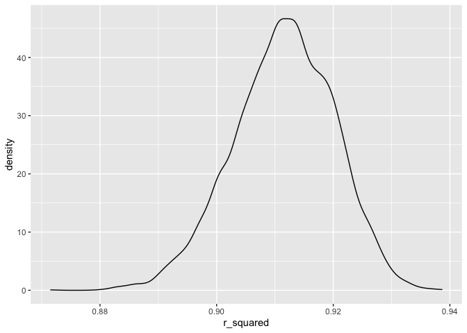
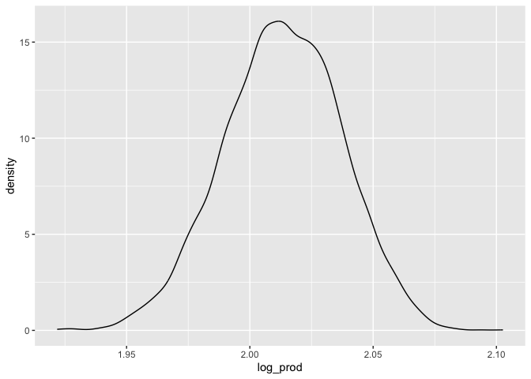
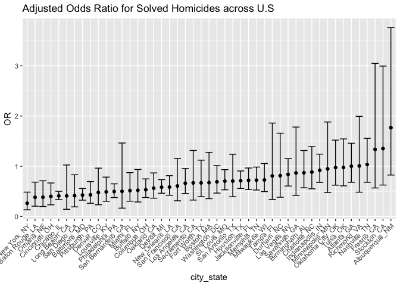
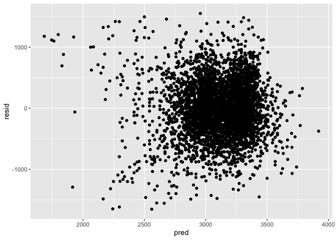
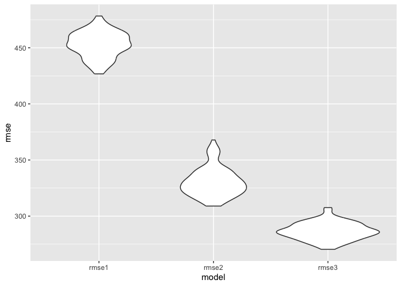

P8105 Homework 6
================
Malika Top (mt3775)
2024-12-02

## Problem 1

#### Loading data

``` r
weather_df = 
  rnoaa::meteo_pull_monitors(
    c("USW00094728"),
    var = c("PRCP", "TMIN", "TMAX"), 
    date_min = "2017-01-01",
    date_max = "2017-12-31") %>%
  mutate(
    name = recode(id, USW00094728 = "CentralPark_NY"),
    tmin = tmin / 10,
    tmax = tmax / 10) %>%
  select(name, id, everything())
```

    ## using cached file: /Users/malikatop/Library/Caches/org.R-project.R/R/rnoaa/noaa_ghcnd/USW00094728.dly

    ## date created (size, mb): 2024-09-26 12:07:02.343695 (8.651)

    ## file min/max dates: 1869-01-01 / 2024-09-30

#### Performing bootstrap and extracting estimates

``` r
weather_bootstrap =
  weather_df |> 
  modelr::bootstrap(n = 5000) |> 
  mutate(
    models = map(strap, \(df) lm(tmax ~ tmin, data = df)),
    results = map(models, broom::tidy),
    summary = map(models, broom::glance),
    r_squared = map_dbl(summary, \(x) x$r.squared),
    log_prod = map_dbl(results, \(x) log(prod(x$estimate)))
  ) |> 
  select(-models, -summary, -strap) |> 
  unnest(results)
```

#### Distribution of estimates

``` r
weather_bootstrap |> 
  ggplot(aes(x = r_squared)) +
  geom_density()
```

<!-- -->

The distribution of the $\hat{r}^{2}$ estimates looks almost symmetrical
with a little bit of a shoulder on the left. It suggests that most of
the bootstrap samples yielded a $\hat{r}^{2}$ value of around 0.91,
which means 91% of the variance in `tmax` can be explained by `tmin`.

``` r
weather_bootstrap |> 
  ggplot(aes(x = log_prod)) +
  geom_density()
```

<!-- -->

The distribution of the log($\hat{\beta_{0}}*\hat{\beta_{1}}$) estimates
is also fairly symmetrical.

#### Confidence intervals

``` r
weather_bootstrap |> 
  group_by(term) |> 
  filter(term == "tmin") |> 
  summarize(
    r_sq_ci_lower = quantile(r_squared, 0.025),
    r_sq_ci_upper = quantile(r_squared, 0.975),
    log_prod_ci_lower = quantile(log_prod, 0.025),
    log_prod_ci_upper = quantile(log_prod, 0.975),
  )
```

    ## # A tibble: 1 × 5
    ##   term  r_sq_ci_lower r_sq_ci_upper log_prod_ci_lower log_prod_ci_upper
    ##   <chr>         <dbl>         <dbl>             <dbl>             <dbl>
    ## 1 tmin          0.893         0.927              1.97              2.06

## Problem 2

#### Reading in and cleaning data

``` r
homicide_df = read.csv("data/homicide-data.csv")
homicide_df = homicide_df |> 
  mutate(
    state = case_when(
      state == "wI" ~ "WI",
      TRUE ~ state
    )
  ) |> 
  unite("city_state", city:state, remove = FALSE) |> 
  mutate(
    #status = ifelse(disposition == "Closed by arrest", 1, 0),
    resolved = as.numeric(disposition == "Closed by arrest"),
    victim_age = as.numeric(victim_age),
    victim_race = fct_relevel(victim_race, "White"),
    victim_sex = as.factor(victim_sex)
  ) 
```

    ## Warning: There was 1 warning in `mutate()`.
    ## ℹ In argument: `victim_age = as.numeric(victim_age)`.
    ## Caused by warning:
    ## ! NAs introduced by coercion

``` r
homicide_df_sub =
  homicide_df |> 
  filter(! city_state %in% c("Dallas_TX", "Phoenix_AZ", "Kansas City_MO", "Tulsa_AL")) |> 
  filter(victim_race == "White" | victim_race == "Black")
```

#### Fitting logistic regression model

``` r
balt_md = 
  homicide_df_sub |> 
  filter(city_state == "Baltimore_MD")
log_reg = 
  balt_md |> 
  glm(resolved ~ victim_age + victim_sex + victim_race, data = _, family = binomial()) 
balt_md_results =
  log_reg |>  
  broom::tidy() |> 
  mutate(OR = exp(estimate), 
         lower_bound = exp(confint(log_reg, "victim_sexMale"))[1],
         upper_bound = exp(confint(log_reg, "victim_sexMale"))[2]
         ) |> 
  filter(term == "victim_sexMale") |> 
  select(term, log_OR = estimate, OR, p.value, lower_bound, upper_bound) 
```

    ## Waiting for profiling to be done...
    ## Waiting for profiling to be done...

``` r
balt_md_results |> 
  knitr::kable(digits=3)
```

| term           | log_OR |    OR | p.value | lower_bound | upper_bound |
|:---------------|-------:|------:|--------:|------------:|------------:|
| victim_sexMale | -0.854 | 0.426 |       0 |       0.324 |       0.558 |

#### GLM for all cities

``` r
glm_results = 
  homicide_df_sub |> 
  nest(data = -city_state) |> 
  mutate(
    models = map(data, \(df) glm(resolved ~ victim_age + victim_sex + victim_race, data = df, family = binomial())),
    results = map(models, \(x) broom::tidy(x, conf.int = TRUE))
  ) |> 
  unnest(results) |> 
  filter(term == "victim_sexMale") |> 
  mutate(
    OR = exp(estimate), 
    lower_bound = exp(conf.low),
    upper_bound = exp(conf.high)
  ) |> 
  select(city_state, OR, lower_bound, upper_bound, p.value)
```

    ## Warning: There were 45 warnings in `mutate()`.
    ## The first warning was:
    ## ℹ In argument: `results = map(models, function(x) broom::tidy(x, conf.int =
    ##   TRUE))`.
    ## Caused by warning:
    ## ! glm.fit: fitted probabilities numerically 0 or 1 occurred
    ## ℹ Run `dplyr::last_dplyr_warnings()` to see the 44 remaining warnings.

``` r
glm_results
```

    ## # A tibble: 47 × 5
    ##    city_state        OR lower_bound upper_bound  p.value
    ##    <chr>          <dbl>       <dbl>       <dbl>    <dbl>
    ##  1 Albuquerque_NM 1.77        0.825       3.76  1.39e- 1
    ##  2 Atlanta_GA     1.00        0.680       1.46  1.00e+ 0
    ##  3 Baltimore_MD   0.426       0.324       0.558 6.26e-10
    ##  4 Baton Rouge_LA 0.381       0.204       0.684 1.65e- 3
    ##  5 Birmingham_AL  0.870       0.571       1.31  5.11e- 1
    ##  6 Boston_MA      0.674       0.353       1.28  2.26e- 1
    ##  7 Buffalo_NY     0.521       0.288       0.936 2.90e- 2
    ##  8 Charlotte_NC   0.884       0.551       1.39  6.00e- 1
    ##  9 Chicago_IL     0.410       0.336       0.501 1.86e-18
    ## 10 Cincinnati_OH  0.400       0.231       0.667 6.49e- 4
    ## # ℹ 37 more rows

#### Plot of estimated ORs and CIs

``` r
glm_results |> 
  mutate(city_state = fct_reorder(city_state, OR)) |> 
  ggplot(aes(x = city_state, y = OR)) +
  geom_point() +
  geom_errorbar(aes(ymin = lower_bound, ymax = upper_bound)) +
  theme(axis.text.x = element_text(angle = 45, hjust = 1)) +
  labs(title = "Adjusted Odds Ratio for Solved Homicides across U.S")
```

<!-- -->

Keeping all other variables fixed, the cities with OR greater than 1 are
Nashville, TN, Fresno, CA, Stockton, CA, and Albuquerque, NM. This means
that for these places, homicides where the victim was male were more
likely to be solved than for female victims. For Richmond, VA, and
Atlanta, GA, with OR practically equal to 1, that means the odds of the
homicide being solved was practically same regardless of gender.

New York, NY has the lowest OR, so the odds of the homicide being solved
is lower for cases where the victim was female. However, it is
interesting that the confidence intervals are widest for the
`city_state` variables that have the higher ORs, and New York’s is
fairly narrow. There are some city-states whose CI do not include 1 like
New York, indicating statistical significance.

## Problem 3

#### Loading and cleaning data for regression analysis

``` r
bwt_df = read.csv("data/birthweight.csv")
bwt_df |> 
  summarise(across(everything(), ~sum(is.na(.x))))
```

    ##   babysex bhead blength bwt delwt fincome frace gaweeks malform menarche
    ## 1       0     0       0   0     0       0     0       0       0        0
    ##   mheight momage mrace parity pnumlbw pnumsga ppbmi ppwt smoken wtgain
    ## 1       0      0     0      0       0       0     0    0      0      0

``` r
bwt_df =
  bwt_df |> 
  mutate(
    babysex = 
        case_match(babysex,
            1 ~ "male",
            2 ~ "female"
        ),
    babysex = fct_infreq(babysex),
    frace = 
        case_match(frace,
            1 ~ "white",
            2 ~ "black", 
            3 ~ "asian", 
            4 ~ "puerto rican", 
            8 ~ "other"),
    frace = fct_infreq(frace),
    mrace = 
        case_match(mrace,
            1 ~ "white",
            2 ~ "black", 
            3 ~ "asian", 
            4 ~ "puerto rican",
            8 ~ "other"),
    mrace = fct_infreq(mrace),
    malform = as.logical(malform))
```

There do not appear to be any NA values.

#### Regression model for `bwt`

There’s a lot of possible predictors for birthweight in this data, so
`lasso` might be a good indicator of which predictors should be
included.

``` r
set.seed(123)
x = model.matrix(bwt ~ ., bwt_df)[,-1]
y = bwt_df |> pull(bwt)
lambda = 10^(seq(-2, 2.75, 0.1))
lasso_fit =
  glmnet(x, y, lambda = lambda)
lasso_cv =
  cv.glmnet(x, y, lambda = lambda)
lambda_opt = lasso_cv[["lambda.min"]]
lasso_fit = 
  glmnet(x, y, lambda = lambda_opt)
lasso_fit |> broom::tidy()
```

    ## # A tibble: 17 × 5
    ##    term               step  estimate lambda dev.ratio
    ##    <chr>             <dbl>     <dbl>  <dbl>     <dbl>
    ##  1 (Intercept)           1 -6044.      1.26     0.718
    ##  2 babysexfemale         1    25.9     1.26     0.718
    ##  3 bhead                 1   130.      1.26     0.718
    ##  4 blength               1    74.9     1.26     0.718
    ##  5 delwt                 1     1.39    1.26     0.718
    ##  6 fincome               1     0.277   1.26     0.718
    ##  7 fracepuerto rican     1   -48.5     1.26     0.718
    ##  8 gaweeks               1    11.4     1.26     0.718
    ##  9 menarche              1    -2.65    1.26     0.718
    ## 10 mheight               1     6.54    1.26     0.718
    ## 11 momage                1     0.495   1.26     0.718
    ## 12 mraceblack            1  -135.      1.26     0.718
    ## 13 mracepuerto rican     1   -48.9     1.26     0.718
    ## 14 mraceasian            1   -59.0     1.26     0.718
    ## 15 parity                1    83.1     1.26     0.718
    ## 16 smoken                1    -4.61    1.26     0.718
    ## 17 wtgain                1     2.62    1.26     0.718

However, it was noted in lecture that lasso doesn’t do much good on the
full dataset since there are so many points. Intuitively though, I would
hypothesize that `mrace` and `malform` are good predictors for
birthweight. For one, it is well-established that race affects
pregnancy-related outcomes and the presence of malformations often mean
the child has not developed as expected, which then usually means
they’re underweight. I also included `gaweeks` since I assumed that
babies with longer gestation periods have more time to developed, a
smilar reasoning to inclusion of `malform`.

``` r
lm1 = lm(bwt ~  malform + mrace + gaweeks, data = bwt_df)
bwt_df |> 
  modelr::add_residuals(lm1) |> 
  modelr::add_predictions(lm1) |> 
  ggplot(aes(x = pred, y = resid)) +
  geom_point()
```

<!-- -->

#### Model comparison

``` r
lm2 = lm(bwt ~ blength + gaweeks, data = bwt_df)
lm3 = lm(bwt ~ bhead*blength*babysex, data = bwt_df)
```

``` r
cv_bwt = 
  crossv_mc(bwt_df, 100)
cv_bwt =
  cv_bwt |> 
  mutate(
    model1 = map(cv_bwt$train, \(df) lm(bwt ~ malform + mrace + gaweeks, data = bwt_df)),
    model2 = map(cv_bwt$train, \(df) lm(bwt ~ blength + gaweeks, data = bwt_df)),
    model3 = map(cv_bwt$train, \(df) lm(bwt ~ bhead*blength*babysex, data = bwt_df))
  ) |> 
  mutate(
    rmse1 = map2_dbl(model1, test, \(mod, df) rmse(model = mod, data = df)),
    rmse2 = map2_dbl(model2, test, \(mod, df) rmse(model = mod, data = df)),
    rmse3 = map2_dbl(model3, test, \(mod, df) rmse(model = mod, data = df))
  )
cv_bwt |> 
  select(starts_with("rmse")) |> 
  pivot_longer(
    everything(),
    names_to = "model", 
    values_to = "rmse",
    names_prefix = "rmse_") |> 
  mutate(model = fct_inorder(model)) |> 
  ggplot(aes(x = model, y = rmse)) + geom_violin()
```

<!-- -->

Based on the RMSEs of the three models, mine definitely does not do as
well as the other two since it has a noticeably higher RMSE. The model
that includes the 3-way interaction seems to do the best, so maybe
including an interaction between `malform` and `gaweeks` would improve
my model. Additionally, the two models I compared mine to are purely
related to the newborn, and does not take into account attributes of the
mother, which I still believe plays a role.
